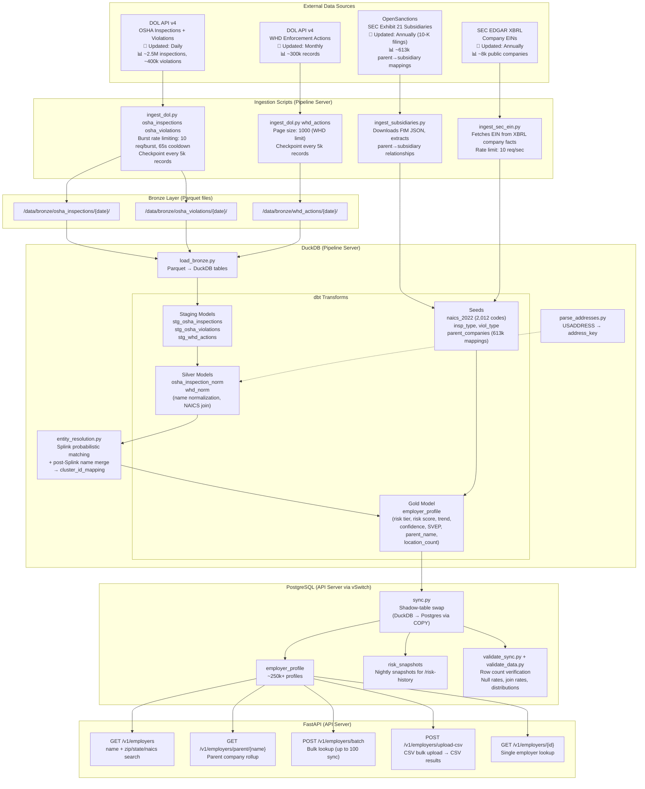

# FastDOL Data Pipeline Architecture

## Data Sources & Update Frequency



## Pipeline Schedule

```
┌─────────────────────────────────────────────────────────────────┐
│                    PIPELINE SCHEDULE                             │
├─────────────────┬───────────────┬───────────────────────────────┤
│ Schedule        │ Cron          │ What Runs                     │
├─────────────────┼───────────────┼───────────────────────────────┤
│ NIGHTLY (2 AM)  │ 0 2 * * *     │ 1. ingest_dol.py (OSHA only)  │
│                 │               │ 2. load_bronze.py              │
│                 │               │ 3. dbt seed + staging + silver │
│                 │               │ 4. parse_addresses.py          │
│                 │               │ 5. entity_resolution.py        │
│                 │               │ 6. dbt gold                    │
│                 │               │ 7. sync.py → Postgres          │
│                 │               │ 8. validate_sync.py            │
│                 │               │ 9. validate_data.py            │
├─────────────────┼───────────────┼───────────────────────────────┤
│ WEEKLY (Sun 1AM)│ 0 1 * * 0     │ 1. ingest_dol.py whd_actions   │
│                 │               │ 2. load_bronze.py              │
│                 │               │    (then nightly picks up rest) │
├─────────────────┼───────────────┼───────────────────────────────┤
│ MONTHLY (1st)   │ 0 0 1 * *     │ 1. ingest_subsidiaries.py      │
│                 │               │ 2. ingest_sec_ein.py           │
│                 │               │    (then nightly picks up rest) │
├─────────────────┼───────────────┼───────────────────────────────┤
│ DAILY (4 AM)    │ 0 4 * * *     │ backup.sh (pg_dump + DuckDB)   │
├─────────────────┼───────────────┼───────────────────────────────┤
│ DAILY (8:30 AM) │ 30 8 * * *    │ check_health.sh                │
├─────────────────┼───────────────┼───────────────────────────────┤
│ HOURLY          │ 0 * * * *     │ rotate_keys.py                 │
├─────────────────┼───────────────┼───────────────────────────────┤
│ EVERY 6 HRS     │ 0 */6 * * *   │ check_disk.sh                  │
├─────────────────┼───────────────┼───────────────────────────────┤
│ MONTHLY (1st)   │ 0 0 1 * *     │ reset_monthly_usage.py         │
└─────────────────┴───────────────┴───────────────────────────────┘
```

## Infrastructure

```
┌─────────────────────────────────────────────────────┐
│              Pipeline Server (AX52)                  │
│              46.224.150.38 / 10.0.0.3                │
│              CCX33: 8 vCPU, 32GB RAM                 │
│                                                      │
│  ┌─────────────────────────────────────────────┐    │
│  │  /opt/employer-compliance/                   │    │
│  │    pipeline/     (ingestion + ETL scripts)   │    │
│  │    dbt/          (transforms + seeds)        │    │
│  │    .env.pipeline (DOL_API_KEY, DB creds)     │    │
│  └─────────────────────────────────────────────┘    │
│                                                      │
│  ┌─────────────────────────────────────────────┐    │
│  │  /data/                                      │    │
│  │    bronze/       (raw Parquet files)          │    │
│  │    duckdb/       (employer_compliance.duckdb) │    │
│  │    backups/      (local, 7-day retention)     │    │
│  └─────────────────────────────────────────────┘    │
│                                                      │
│  Cron: run_pipeline.sh (nightly)                     │
│         run_weekly.sh (Sundays)                      │
│         run_monthly.sh (1st of month)                │
└──────────────────────┬──────────────────────────────┘
                       │ vSwitch (10.0.0.0/24)
┌──────────────────────┴──────────────────────────────┐
│              API Server (CPX42)                       │
│              88.198.218.234 / 10.0.0.2               │
│              8 vCPU, 16GB RAM                        │
│                                                      │
│  nginx (TLS) → FastAPI (uvicorn :8001)               │
│  PostgreSQL 16 ← pgBouncer                           │
│  Metabase (:3000)                                    │
│                                                      │
│  systemd: fastdol-api.service                        │
└─────────────────────────────────────────────────────┘
```

## Data Flow Summary

1. **Ingestion** — Scripts fetch from external APIs, write Parquet to `/data/bronze/`
2. **Load** — `load_bronze.py` reads Parquet into DuckDB raw tables
3. **Transform** — dbt staging (rename columns) → silver (normalize names, addresses, NAICS) → gold (aggregate by employer, risk scoring)
4. **Entity Resolution** — Splink clusters similar establishments, `cluster_id_mapping` assigns stable UUIDs
5. **Enrichment** — Parent company seed maps subsidiaries to parent names, NAICS seed adds industry descriptions
6. **Sync** — Shadow-table swap: DuckDB gold → Postgres `employer_profile` via COPY + atomic RENAME
7. **Serve** — FastAPI reads from Postgres via pgBouncer, serves search/batch/upload/parent endpoints
