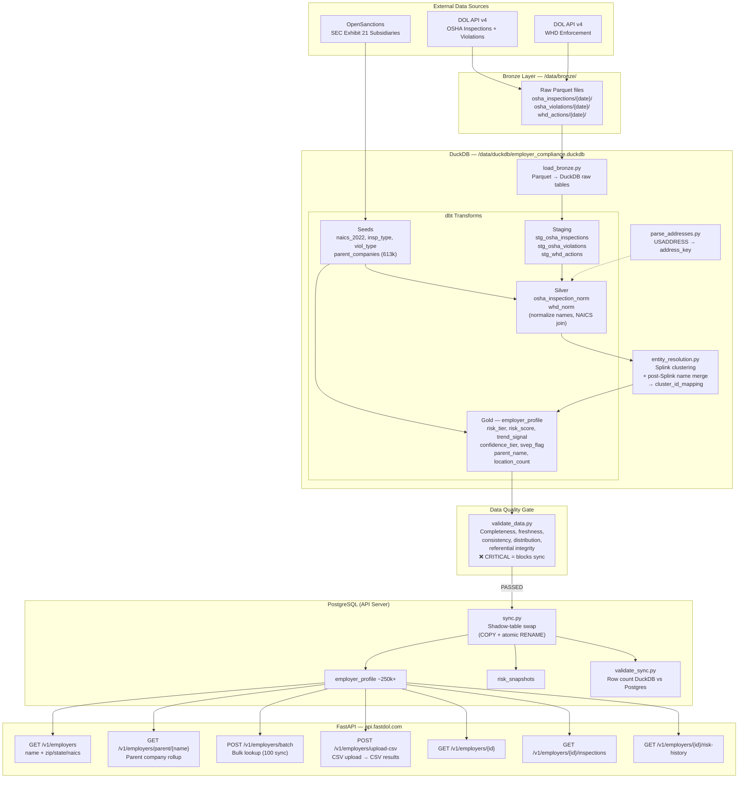

# FastDOL Data Pipeline Architecture

## Data Sources

| Source | API/URL | Update Frequency | Our Schedule | Script | Records |
|--------|---------|-----------------|-------------|--------|---------|
| OSHA Inspections | DOL API v4 `osha/inspection` | Daily | Nightly 2AM | `ingest_dol.py osha_inspections` | ~2.5M |
| OSHA Violations | DOL API v4 `osha/violation` | Daily | Nightly 2AM | `ingest_dol.py osha_violations` | ~400k |
| WHD Enforcement | DOL API v4 `whd/enforcement` | Monthly | Weekly Sun 1AM | `ingest_dol.py whd_actions` | ~300k |
| SEC Exhibit 21 (parent companies) | OpenSanctions CorpWatch | Annually (10-K filings) | Monthly 1st | `ingest_subsidiaries.py` | ~613k mappings |
| NAICS codes | Census.gov (seed CSV) | Rarely | Bundled in repo | dbt seed `naics_2022` | 2,012 |

## Pipeline Flow



## Nightly Pipeline Steps (run_pipeline.sh)

| Step | Script | What it does | Failure behavior |
|------|--------|-------------|-----------------|
| 1 | `ingest_dol.py osha_inspections osha_violations` | Fetch new OSHA data from DOL API, write Parquet | Checkpoints every 5k records; skips bad batches after 3 retries |
| 2 | `load_bronze.py` | Load Parquet files into DuckDB raw tables | Fails pipeline |
| 3 | `dbt seed` + `dbt run --select staging silver` | Load seeds, run staging + silver transforms | Fails pipeline; WHD error OK if not loaded yet |
| 4 | `parse_addresses.py` | Normalize addresses via USADDRESS | Fails pipeline |
| 5 | `entity_resolution.py` | Splink probabilistic matching + name merge | Fails pipeline |
| 6 | `dbt run --select gold` | Build employer_profile with risk scoring + parent matching | Fails pipeline |
| 7 | `validate_data.py` | **Data quality gate** — checks completeness, freshness, consistency, distribution | **CRITICAL failure blocks sync** — bad data never reaches Postgres |
| 8 | `sync.py` | Shadow-table swap: DuckDB → Postgres via COPY + atomic RENAME | Rolls back on error |
| 9 | `validate_sync.py` | Verify row counts match between DuckDB and Postgres | Alerts but data already live |

## Full Schedule

| Schedule | Cron | Script | Purpose |
|----------|------|--------|---------|
| **Nightly** | `0 2 * * *` | `run_pipeline.sh` | OSHA ingestion → full pipeline → sync to Postgres |
| **Weekly** | `0 1 * * 0` | `run_weekly.sh` | WHD enforcement data refresh (nightly integrates it) |
| **Monthly** | `0 0 1 * *` | `run_monthly.sh` | SEC subsidiary data + dbt seed reload |
| Backup | `0 4 * * *` | `backup.sh` | pg_dump + DuckDB checkpoint |
| Health check | `30 8 * * *` | `check_health.sh` | Verify API + DB health |
| Key rotation | `0 * * * *` | `rotate_keys.py` | Expire rotating_out keys past 48h |
| Disk check | `0 */6 * * *` | `check_disk.sh` | Alert if disk usage high |
| Usage reset | `5 0 1 * *` | `reset_monthly_usage.py` | Reset customer API quotas |

## Infrastructure

```
Pipeline Server (CCX33)                    API Server (CPX42)
46.224.150.38 / 10.0.0.3                  88.198.218.234 / 10.0.0.2
8 vCPU, 32GB RAM                          8 vCPU, 16GB RAM
                                          
/opt/employer-compliance/                  nginx (TLS) → uvicorn :8001
  pipeline/  (ingestion + ETL)             PostgreSQL 16 ← pgBouncer
  dbt/       (transforms + seeds)          Metabase (:3000)
  .env.pipeline                            .env.api
                                          
/data/                                     systemd: fastdol-api.service
  bronze/    (raw Parquet)                
  duckdb/    (employer_compliance.duckdb)  
  backups/   (7-day retention)            
  dq_snapshots/ (daily quality metrics)   
                                          
Connected via Hetzner vSwitch (10.0.0.0/24)
sync.py pushes data Pipeline → API over private network
```

## Data Quality Gate (validate_data.py)

Runs **before** sync. If any CRITICAL check fails, sync is blocked and customers keep yesterday's (good) data.

| Check | Severity | Threshold |
|-------|----------|-----------|
| OSHA inspections exist | CRITICAL | > 2M records |
| OSHA violations exist | CRITICAL | > 300k records |
| Employer profiles exist | CRITICAL | > 200k profiles |
| Violation→inspection join | CRITICAL | > 95% join rate |
| All employer_ids valid UUIDs | CRITICAL | 0 invalid |
| employer_name not null | CRITICAL | 0% null |
| Profile count vs previous run | CRITICAL | Not dropped > 10% |
| Latest OSHA inspection fresh | WARNING | < 6 months old |
| Risk tier distribution stable | WARNING | < 50% swing vs previous |
| State/zip null rates | WARNING | < 15-20% |
| WHD actions loaded | WARNING | > 100k if present |

Daily snapshots saved to `/data/dq_snapshots/` for run-over-run regression detection.
